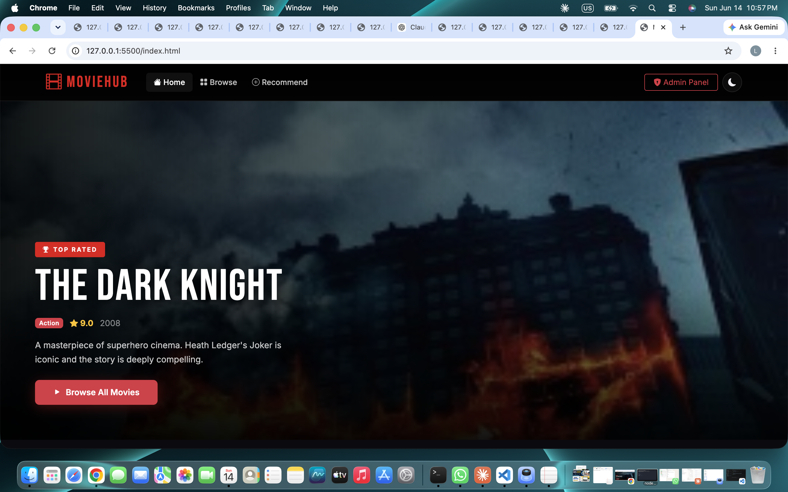
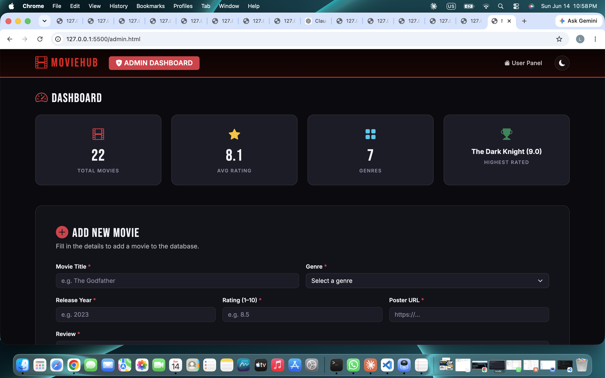
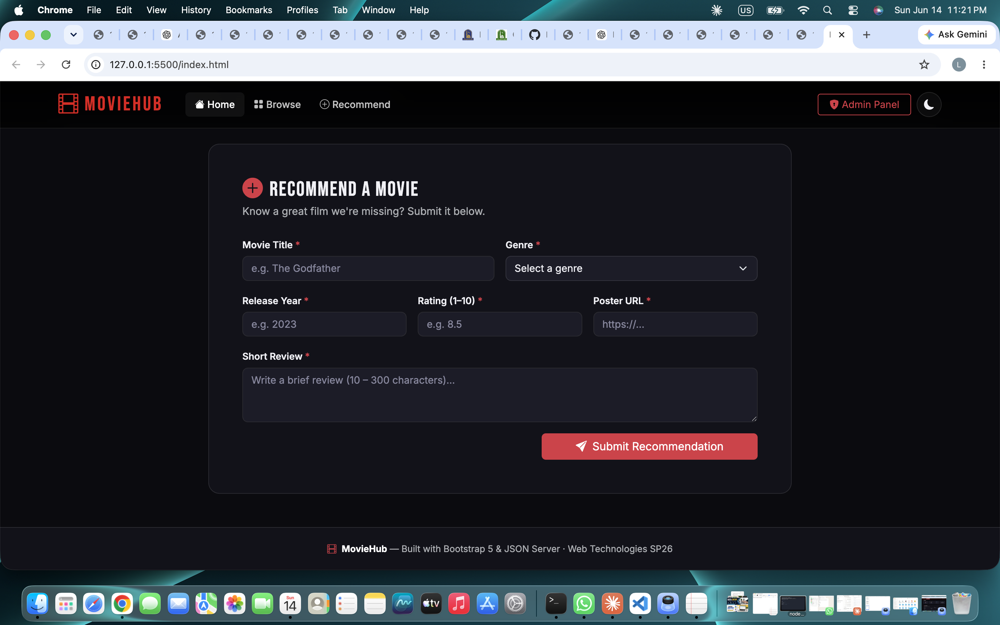
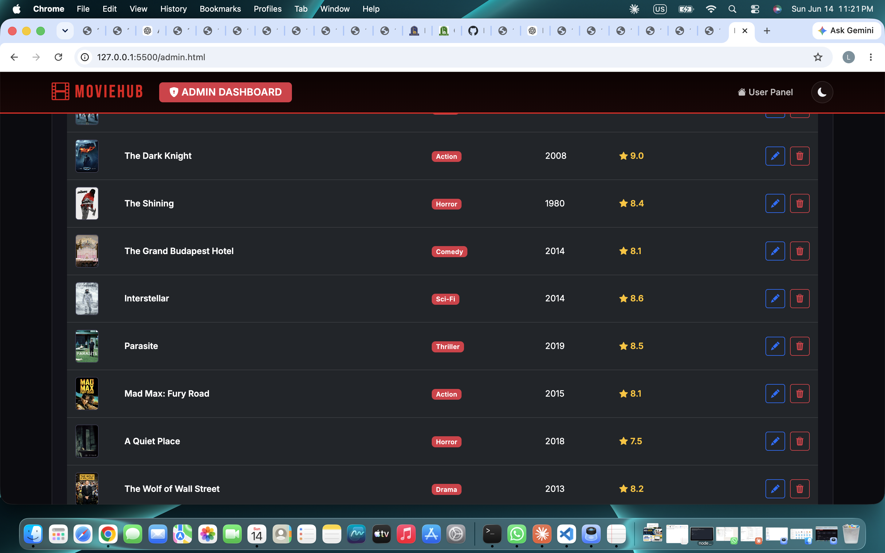

# 🎬 MovieHub – Movie Recommendation & Management System

> **Web Technologies SP26 · BSCS 4th Semester**  
> **Student Name:** [Saim Khizar Awan]
> **Roll Number:** [F24BDOCS1M04006]
> **Section** [1M]

---

## 📖 Project Description

MovieHub is a full-stack-style movie recommendation and management platform built with plain JavaScript, Bootstrap 5, and JSON Server as the mock REST API backend.

Users can browse, search, and filter a curated movie catalogue, and submit their own movie recommendations via a validated form. Admins get a separate dashboard to manage all movies (add, edit, delete) and view live statistics.

---

## ✨ Features

### User Panel (`index.html`)
- 🎥 **Hero Banner** – dynamically loaded with the highest-rated movie
- 🔍 **Debounced Search** – filters by title in real time (300ms delay)
- 🎭 **Genre Filter** – dropdown to filter movies by genre
- 🃏 **Movie Cards** – glassmorphism cards with poster, rating, genre badge, and review
- ⏳ **Loading Spinner** – shown while fetching from JSON Server
- ⚠️ **Error Alert** – shown if JSON Server is unreachable
- 📭 **Empty State** – shown when no movies match the search/filter
- 📝 **Recommendation Form** – POST a new movie with full inline validation (no alert())
- 🌙 **Dark/Light Mode Toggle** – persisted in `localStorage`

### Admin Panel (`admin.html`)
- 📊 **Statistics Dashboard** – Total Movies, Average Rating, Total Genres, Highest Rated
- ➕ **Add Movie Form** – POST new movies with inline validation
- ✏️ **Edit Movie** – loads data into form, saves via PUT
- 🗑️ **Delete Movie** – confirmation modal before DELETE request
- 📋 **Management Table** – view all movies with poster, title, genre, year, rating, and action buttons
- 🔒 **Visual Distinction** – red-bordered navbar and ADMIN DASHBOARD badge

### Bonus Features (+5 marks)
- ✅ Bootstrap 5 used consistently throughout
- ✅ Fully responsive (mobile → tablet → desktop)
- ✅ Dark Mode toggle with `localStorage` persistence
- ✅ Debounced search input
- ✅ Empty state with icon and message
- ✅ Loading spinner while fetching

---

## 🛠️ Technologies Used

| Layer      | Technology                          |
|------------|-------------------------------------|
| Markup     | HTML5 (semantic: nav, main, section, form) |
| Styling    | Bootstrap 5.3, Custom CSS (glassmorphism) |
| Fonts      | Google Fonts – Bebas Neue, Inter    |
| Icons      | Bootstrap Icons 1.11                |
| JavaScript | Plain JavaScript (ES6+), Fetch API, async/await |
| Backend    | JSON Server (mock REST API)         |
| Data       | JSON (`db.json`)                    |

---

## 📁 Folder Structure

```
MovieHub/
├── index.html      # User-facing page
├── admin.html      # Admin dashboard
├── style.css       # All custom styling
├── app.js          # User panel JavaScript
├── admin.js        # Admin panel JavaScript
├── db.json         # JSON Server database (22 movies)
└── README.md       # This file
```

---

## ⚙️ Installation & Setup

### Prerequisites
- [Node.js](https://nodejs.org/) (v14 or higher)
- A modern browser (Chrome, Firefox, Edge)

### Step 1 – Install JSON Server

```bash
npm install -g json-server
```

### Step 2 – Clone / Download the Project

Download and extract the project ZIP, then open a terminal inside the `MovieHub/` folder.

### Step 3 – Start JSON Server

```bash
npx json-server --watch db.json
```

You should see:

```
JSON Server started on PORT :3000
Press CTRL-C to quit

( ˶ˆ ᗜ ˆ˵ )

GET    /movies
POST   /movies
PUT    /movies/:id
DELETE /movies/:id
```

### Step 4 – Open the Project

Open `index.html` directly in your browser **while JSON Server is running**:

- **User Panel:** `index.html`
- **Admin Panel:** `admin.html`

> ⚠️ **Important:** JSON Server must be running on `http://localhost:3000` before opening any page.

---

## 🚀 How to Run (Quick Reference)

```bash
# Terminal 1 – start the API
npx json-server --watch db.json

# Then open index.html in your browser
```

---
### Project Screenshots

**User Panel:**


**Admin Panel:**


**Form Page:**


**Edit Page:**

---

## 🔮 Future Improvements

- **Pagination** – add page controls for large movie collections
- **Sort Controls** – sort by rating, year, or title with direction toggle
- **CSV Export** – download filtered movie list as CSV
- **User Accounts** – separate login for admins vs regular users
- **Movie Detail Modal** – full review popup on card click
- **Favourites** – let users heart/save movies locally
- **Chart.js Dashboard** – visual genre distribution and rating histogram

---

## 📚 API Reference

Base URL: `http://localhost:3000`

| Method | Endpoint        | Description           |
|--------|-----------------|-----------------------|
| GET    | `/movies`       | Fetch all movies      |
| POST   | `/movies`       | Add a new movie       |
| PUT    | `/movies/:id`   | Update a movie fully  |
| DELETE | `/movies/:id`   | Remove a movie        |

---

*Built for Web Technologies SP26 · Individual Capstone Project*
